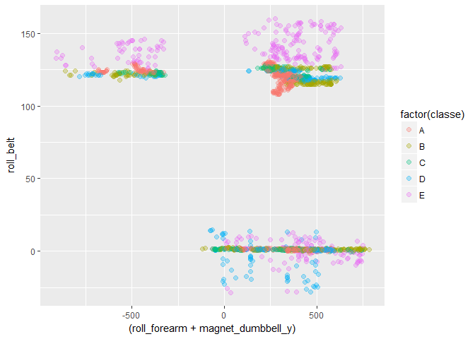

# Prediction Assignment Practical Machine Learning
Helen Levy-Myers  
`r format(Sys.Date())`  


## Background
This report examines the effort taken to find a prediction model for dumbbell bicep curls. The data set*  was designed to examine how "well" six individuals did bicep curls. Each person did biceps curls correctly, then made four different errors, throwing their elbows to the front, lifting only halfway, lowering only halfway, and throwing their hips to the front. Sensors added to the dumbbell, the waist belt, forearm and upper arm recorded data in x, y, and z axes plus other variables include roll, pitch, yaw, gryos, acceleration, time, user name, kurtosis, skewness, amplitude, magnet, with calculated averages, variation, standard deviation, for a total of 160 variables including the variable that identifies how the curl was performed, correctly or which error. 

If one does not regularly do bicep curls, one might not understand how they are done properly or what mistakes might look like. YouTube fortunately has many videos doing "Unilateral dumbbell biceps curls" and several more on "Top Mistakes Doing Bicep Curls." After watching numerous videos, one will understand that the upper arm and waist belt barely move when doing bicep curls properly. When moving the elbows to the front incorrectly, the dumbbell has a higher arc. Throwing the hips to the front should be indicated on the belt sensor and not necessarily during other movements.

## Cleaning Data
The data set is quite large with more than 19,000 observations and 160 variables. A very small testing data set was provided for final analysis. As best practice a validation test was created of 30 percent of the data and an exploring data set of 2,000 observations. The research was done on the exploring data until the final model was decided upon. The original data set included many columns with NAs and blank cells as they were columns with calculations across many observations. These columns were eliminated from the exploring data set and reduced the data set to 53 columns. The outcome variable was the "classe" of bicep curl and was originally a character variable. As part of the cleaning process it was converted to a factor variable with five levels, A, B, C, D, and E.

## Exploratory Analysis
After watching many videos, one could guess that a belt movement variable would be important. Some quick plots were done to look at the belt movement variable data. There are 38 variables measuring some aspect of belt movement. The E classe variable identified the throwing the hips forward movement which was easy to find in some plots. 

```r
#create validation test set
inTrain <- createDataPartition(y=dumbbell$classe, p =.7, list = FALSE)
training <- dumbbell[inTrain, ]
validation <- dumbbell[-inTrain, ]
training$classe <- as.factor(training$classe)
set.seed(123)
exploring <- sample_n(training, 2000)
exploring <- as.data.frame(exploring)

#data set without na values
exploringy <- select(exploring, 1, 9:12, 38:50, 61:69, 85:87, 103, 114:125, 141, 152:160) 
```

```r
#plot that separates throwing hips to front well, lowering halfway somewhat, other movements not separated
idea2 <- ggplot(exploring, aes(x = (roll_forearm+magnet_dumbbell_y), y = roll_belt, colour = factor(classe))) 
idea2 + geom_point(size = 2, alpha =.3)
```

<!-- -->

## Models
Being able to predict one classe was possible, but the goal was to predict all five different classes. Using the caret package, several different models were examined including the rf, rpart, rpart2, ada, and pca methods. The rpart2 method was able to build a tree that had all five classes in separate leaves. The seven variables were used to build other models. Various models were tried. Although it could separate the classes, the accuracy was at best 90% and a higher accuracy was desired. 


```r
idea6 <- train(classe~., method ="rpart2", data = exploringy) #finds seven variables inlcudes tuning parameters
print(idea6$finalModel)
```

```
## n= 2000 
## 
## node), split, n, loss, yval, (yprob)
##       * denotes terminal node
## 
##  1) root 2000 1425 A (0.29 0.2 0.17 0.17 0.17)  
##    2) roll_belt< 130.5 1830 1256 A (0.31 0.22 0.19 0.19 0.093)  
##      4) pitch_forearm< -27.6 162    3 A (0.98 0.019 0 0 0) *
##      5) pitch_forearm>=-27.6 1668 1253 A (0.25 0.24 0.21 0.21 0.1)  
##       10) magnet_dumbbell_y< 439.5 1410 1001 A (0.29 0.18 0.23 0.21 0.09)  
##         20) roll_forearm< 126.5 902  539 A (0.4 0.21 0.16 0.18 0.045)  
##           40) magnet_dumbbell_z< 35.5 545  238 A (0.56 0.16 0.1 0.15 0.029) *
##           41) magnet_dumbbell_z>=35.5 357  253 B (0.16 0.29 0.25 0.23 0.07) *
##         21) roll_forearm>=126.5 508  326 C (0.091 0.13 0.36 0.25 0.17)  
##           42) magnet_dumbbell_y< 290.5 305  146 C (0.098 0.092 0.52 0.13 0.16) *
##           43) magnet_dumbbell_y>=290.5 203  116 D (0.079 0.19 0.11 0.43 0.19) *
##       11) magnet_dumbbell_y>=439.5 258  120 B (0.023 0.53 0.062 0.21 0.17)  
##         22) total_accel_dumbbell>=5.5 190   61 B (0.032 0.68 0.084 0.011 0.19)  
##           44) roll_belt>=-0.615 163   34 B (0.037 0.79 0.098 0.012 0.061) *
##           45) roll_belt< -0.615 27    0 E (0 0 0 0 1) *
##         23) total_accel_dumbbell< 5.5 68   15 D (0 0.13 0 0.78 0.088) *
##    3) roll_belt>=130.5 170    1 E (0.0059 0 0 0 0.99) *
```

```r
#final leaves of tree with seven variable and probabilities of each classification (A, B, C, D, E)
```
To get better accuracy, another direction was taken to add all the variables in using the dot option and change the method. Three classification methods were chosen, rf (random forest) which had an out of bounds error rate of 5.15% or accuracy rate of 94.85%, svmRadical, which had a significantly higher out of bounds error rate, and xgboost. 

## Best Fit
The xgboost method, or extreme gradient boosting, was determined to be the best model. It has almost perfect prediction across the entire exploring data set. The only problem with this model is that it takes a long time to run for large data sets as is used in this report. The Accuracy rate with the validation data set of 30% of the training set is 96.04%. As with the plot, classe E, throwing the hips forward, is the easiest to separate and has the lowest misapplied rate with less than 10 misapplied observations out of more than 1,000 E classe. 

```r
validation$classe <- as.factor(validation$classe)
validationy <- select(validation, 1, 9:12, 38:50, 61:69, 85:87, 103, 114:125, 141, 152:160)
idea11 <- train(classe~ ., method= "xgbTree", data = exploringy) #The BEST model
ideaPred11 <- predict(idea11, newdata = validationy)
confusionMatrix(ideaPred11, validationy$classe)
```

```
## Confusion Matrix and Statistics
## 
##           Reference
## Prediction    A    B    C    D    E
##          A 1646   48    2    1    2
##          B   12 1043   28    3   10
##          C   10   42  975   32    6
##          D    6    0   19  923   17
##          E    0    6    2    5 1047
## 
## Overall Statistics
##                                           
##                Accuracy : 0.9573          
##                  95% CI : (0.9519, 0.9624)
##     No Information Rate : 0.2845          
##     P-Value [Acc > NIR] : < 2.2e-16       
##                                           
##                   Kappa : 0.946           
##  Mcnemar's Test P-Value : 1.629e-07       
## 
## Statistics by Class:
## 
##                      Class: A Class: B Class: C Class: D Class: E
## Sensitivity            0.9833   0.9157   0.9503   0.9575   0.9677
## Specificity            0.9874   0.9888   0.9815   0.9915   0.9973
## Pos Pred Value         0.9688   0.9516   0.9155   0.9565   0.9877
## Neg Pred Value         0.9933   0.9800   0.9894   0.9917   0.9927
## Prevalence             0.2845   0.1935   0.1743   0.1638   0.1839
## Detection Rate         0.2797   0.1772   0.1657   0.1568   0.1779
## Detection Prevalence   0.2887   0.1862   0.1810   0.1640   0.1801
## Balanced Accuracy      0.9853   0.9523   0.9659   0.9745   0.9825
```

## Cross Validation
To cross validate the model, a validation data set was created at beginning with 30% of the training set. The accuracy measure for the validation data set was 95.63%. Finally, the entire training set was run and its accuracy measure was 96.71%. 

```r
training <- as.data.frame(training)
trainingy <- select(training, 1, 9:12, 38:50, 61:69, 85:87, 103, 114:125, 141, 152:160) #data set without na values
ideaPred11a <- predict(idea11, newdata = trainingy)
confusionMatrix(ideaPred11a, trainingy$classe)
```

```
## Confusion Matrix and Statistics
## 
##           Reference
## Prediction    A    B    C    D    E
##          A 3848   86    5    3    0
##          B   29 2486   57    3   19
##          C   17   66 2297   59   14
##          D   12    5   33 2174   29
##          E    0   15    4   13 2463
## 
## Overall Statistics
##                                           
##                Accuracy : 0.9659          
##                  95% CI : (0.9627, 0.9688)
##     No Information Rate : 0.2843          
##     P-Value [Acc > NIR] : < 2.2e-16       
##                                           
##                   Kappa : 0.9568          
##  Mcnemar's Test P-Value : NA              
## 
## Statistics by Class:
## 
##                      Class: A Class: B Class: C Class: D Class: E
## Sensitivity            0.9852   0.9353   0.9587   0.9654   0.9754
## Specificity            0.9904   0.9903   0.9862   0.9931   0.9971
## Pos Pred Value         0.9762   0.9584   0.9364   0.9649   0.9872
## Neg Pred Value         0.9941   0.9846   0.9912   0.9932   0.9945
## Prevalence             0.2843   0.1935   0.1744   0.1639   0.1838
## Detection Rate         0.2801   0.1810   0.1672   0.1583   0.1793
## Detection Prevalence   0.2870   0.1888   0.1786   0.1640   0.1816
## Balanced Accuracy      0.9878   0.9628   0.9725   0.9792   0.9863
```

## Conclusion
The best model to classify bicep curl movements is made using the extreme gradient boosting method in the caret package with all the variables. This provides an error rate less than 5% for the exploratory, validation and training data sets. 


*Velloso, E.; Bulling, A.; Gellersen, H.; Ugulino, W.; Fuks, H. Qualitative Activity Recognition of Weight Lifting Exercises. Proceedings of 4th International Conference in Cooperation with SIGCHI (Augmented Human '13) . Stuttgart, Germany: ACM SIGCHI, 2013.
